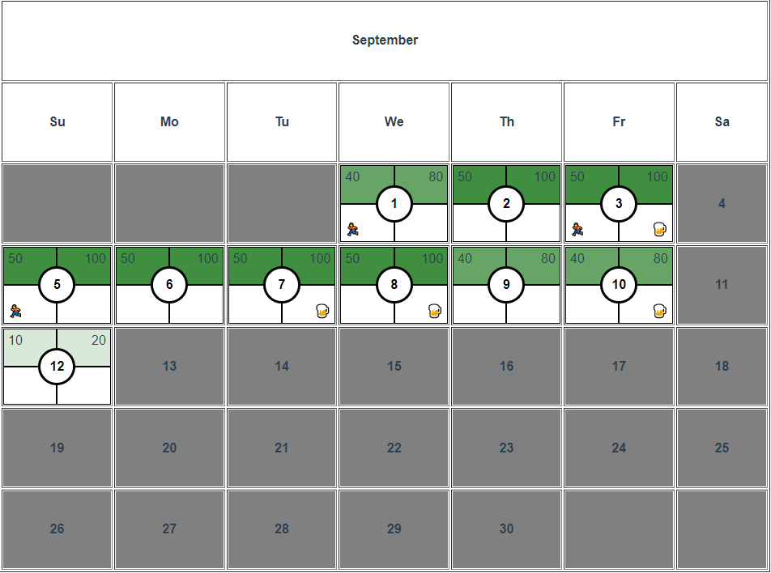

# Daily Tracker

A simple app to track several categories of daily and/or weekly activities
<table align="center">
  <thead>
    <tr>
      <th>Skills</th>
      <th>Technologies</th>
    </tr>
  </thead>
  <tbody>
    <tr>
      <td>Languages</td>
      <td>
        
        
      </td>
    </tr>
    <tr>
      <td>Front-End</td>
      <td>
        
        
        
      </td>
    </tr>
    <tr>
      <td>Back-End</td>
      <td>
        
        
      </td>
    </tr>
    <tr>
      <td>Testing</td>
      <td>
        Coming Soon
      </td>
    </tr>
    <tr>
      <td>Database</td>
      <td>
        
      </td>
    </tr>
  </tbody>
</table>

## Project Status

Currenty the app is setup to track four categories of daily activities: daily pushups, daily situps, whether I've gone for a run on the day, and whether I consumed alcohol on the day.

It presents daily data in a couple of ways: the CalendarView view renders a CalendarDay component for each day in the calendar. For each individual CalendarDay, the four data are shown in quadrants. The Pushup and Situp quadrants dynamically change background color based on how close to my rep goal I've gotten to on the day, as well as showing the rep number. The run and alcohol quadrants display an icon depending on if I've run or consumed alcohol, respectively:

When a date is clicked, the DayView view shows a simple form for taking in new data, which has already input data bound to the input placeholders. From this form you can either return to the calendar view without submitting, or submit and return to the calendar view:

The Header component also dynamically tracks situps and pushups for the current day:

### Next Steps

- Create a MonthlyData view which tallies all input data and shows various metrics (pushups done this month, etc.)

- Add ability to track run distance

- Styling styling styling

## Instillation and setup instructions
Fork, clone, and then

- To install dependancies:

    `npm install`

- To compile and set up the Vue SPA for hot-reloading:

    `npm run serve`

- To compile and run the Node server:

    `npm run back`

- To set tsc to watch mode if you'd like to make changes to the back end in realtime:

    `tsc -w`

At the moment, the app isn't set up to easily change the types of tracked data. However, if you would like to use it but want to set different situp and pushup goals, you can do that by altering the appropriate values in `utils/constants.ts`:

 

## Reflection

Stay tuned!

### Customize configuration
See [Configuration Reference](https://cli.vuejs.org/config/).

